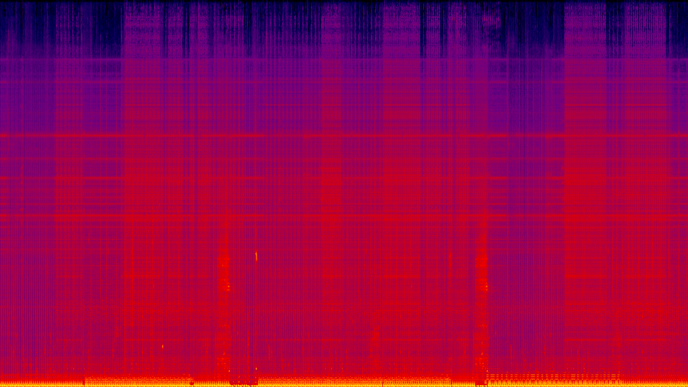

# Classifying the moods of songs
**General Assembly Data Science Immersive - final Capstone Project** 

The purpose of the project is to create a machine learning classifier which predicts the mood of a song - specifically, using Audiofiles library of mood grouped sounds.

## Background and problem statement
We often see individuals run projects on classifying genres of music, and whilst I personally find this interesting, I feel that we don't always choose to listen to music based on genres.
Often individuals and groups listen to music based on their mood, so why not attempt to classify off this instead?
This project aims to do this.

A challenge many find regarding this is that it's harder to find data available for music grouped by mood compared to genres. Many are able to turn to Spotify, YouTube and other platforms to pull songs based on genres though this is harder to find for moods.
Fortunately Audioset has a large library of YouTube id's grouped by seven moods (happy, funny, sad, tender, exciting, angry, scary).

In addition, I was keen to explore whether using features from spectrograms would provide an accurate model for analysis.
A spectrogram is a visual representation of an audio frequency over a period of time. Many use these for assessing things like heart-beat abnormalities though this technique is being increasingly used within the music sphere.

## Objectives
1. Find a list of song names tagged to a mood(s).
2. Identify music from the data.
3. Extract new features from music to create new data.
4. Perform necessary EDA and pre-processing.
5. Run classification models to predict the moods of songs.

## Classifiers & Accuracy Scores:
1. Logistic Regression - 59%
2. Support Vector Machines - 49.1%
3. Random Forests - 57.3%
4. Baseline - 34.12%

## Conclusion
As you can see from above, my scores performed better than the baseline, though these models need to be improved before one can confidently apply this to something practical like a mood based recommendation system. One of the challenges with extracting spectral features from a sound was that many of the features were returned  as a matrix instead of individual values. This meant I had to find a way to aggregate each cell, eventually deciding to use the numpy.ravel() function to flatten each array, followed by the use of aggregate functions. As a next step, I'm going to use an image recognition model within a Convolutional Neural Network to analyse each song's spectrogram image to optimistically improve my accuracy, precision and recall.

## Key tools for this project
- NumPy, Pandas, Matplotlib, scikit-learn, Seaborn 
- Moviepy, scipy.io, Librosa
